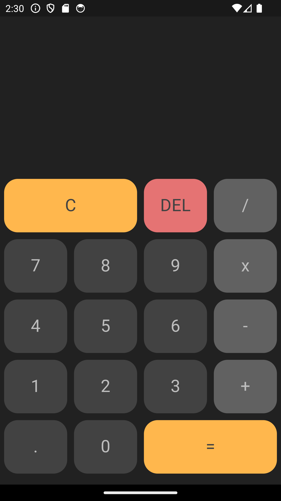
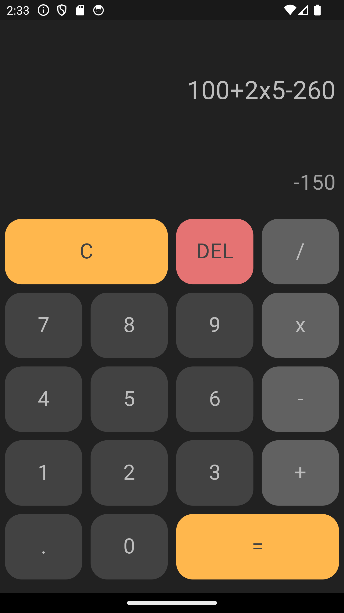

# Calculator App

A simple calculator app built with Flutter that supports basic arithmetic operations such as addition, subtraction, multiplication, and division. The app features a clean user interface with customizable themes and buttons.

## Features

- **Dynamic Display**: Shows the current input and result in a scrollable display area.
- **Basic Operations**: Supports addition, subtraction, multiplication, and division.
- **Clear and Delete Functions**: Includes `C` (clear all) and `DEL` (delete last input) buttons.
- **Responsive Button Layout**: Buttons are arranged in a grid layout and respond to user taps.
- **Smooth Scrolling**: Automatically scrolls the input field to the most recent user entry.
- **Custom Theming**: The app supports dynamic theming, allowing customization of button and text colors.

## Screenshots

### Main Calculator Screen

### Calculator Example

Ensure you have the following installed on your machine:

- [Flutter SDK](https://flutter.dev/docs/get-started/install)
- [Dart SDK](https://dart.dev/get-dart)
